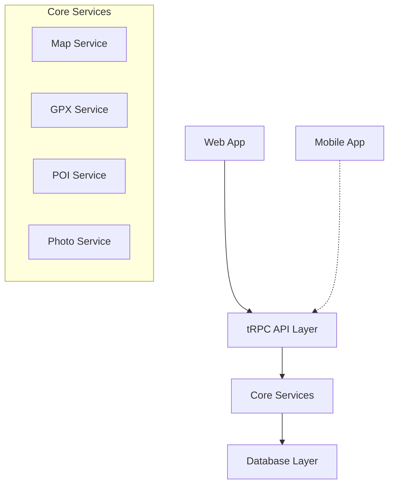
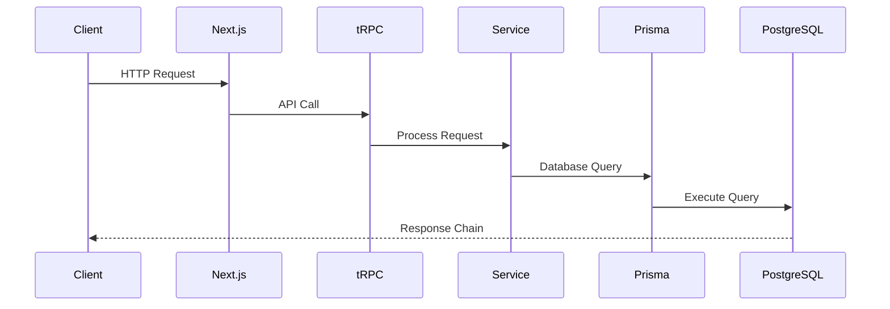
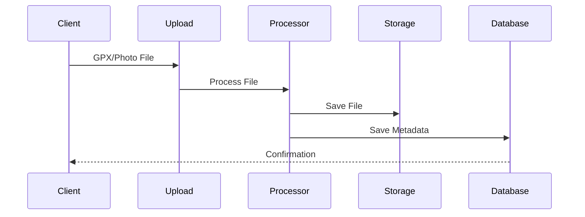

# System Architecture

## Architecture Overview



## Package Architecture

### Apps Layer (`/apps`)

```bash
apps/
├── web/                          # Next.js web application
│   ├── app/                     # Next.js 14 app router
│   │   ├── (auth)/             # Auth routes
│   │   ├── map/                # Map pages
│   │   └── api/                # API routes
│   ├── components/             # App-specific components
│   └── features/               # Feature implementations
│
└── mobile/                      # Future Expo application
```

### Packages Layer (`/packages`)

```bash
packages/
├── ui/                          # Shared UI components
│   ├── components/             # Base components
│   │   ├── map/               # Map-specific components
│   │   ├── navigation/        # Navigation components
│   │   └── forms/             # Form components
│   └── styles/                # Shared styles
│
├── map-core/                    # Core mapping functionality
│   ├── services/              # Map services
│   ├── processors/            # Data processors
│   └── utils/                 # Map utilities
│
├── api/                         # tRPC API definitions
│   ├── routers/               # API routers
│   └── procedures/            # API procedures
│
└── db/                          # Database package
    ├── prisma/                # Prisma configuration
    └── migrations/            # Database migrations
```

## Data Flow Architecture

### 1. Request Flow


### 2. File Processing Flow


## Core Systems

### 1. Authentication System
- Auth0 integration
- Role-based access control
- Session management
- Security middleware

### 2. Map System
- MapBox GL JS integration
- Custom layer management
- Event handling
- State management

### 3. Data Management
- PostgreSQL with PostGIS
- Prisma ORM
- Data validation
- Type safety

### 4. API Layer
- tRPC routers
- Type-safe procedures
- Error handling
- Rate limiting

## Feature Integration

### 1. GPX Integration
```typescript
// packages/map-core/services/gpx.service.ts
interface GpxService {
  upload(file: File): Promise<GpxResult>;
  process(data: GpxData): Promise<ProcessedRoute>;
  save(route: ProcessedRoute): Promise<SavedRoute>;
}
```

### 2. POI Integration
```typescript
// packages/map-core/services/poi.service.ts
interface PoiService {
  create(data: PoiData): Promise<Poi>;
  attach(poiId: string, resourceId: string): Promise<void>;
  query(bounds: BoundingBox): Promise<Poi[]>;
}
```

### 3. Photo Integration
```typescript
// packages/map-core/services/photo.service.ts
interface PhotoService {
  upload(file: File): Promise<Photo>;
  process(photo: Photo): Promise<ProcessedPhoto>;
  attachToResource(photoId: string, resourceId: string): Promise<void>;
}
```

## Performance Considerations

### 1. Data Loading
- Implement lazy loading
- Use React Suspense
- Stream large datasets
- Cache strategies

### 2. State Management
- Local component state
- React Context for shared state
- Server state with React Query
- Optimistic updates

### 3. Asset Optimization
- Image optimization
- Code splitting
- Bundle optimization
- CDN integration

## Error Handling

### 1. Client-Side
```typescript
// packages/ui/utils/error-handling.ts
interface ErrorHandler {
  handleApiError(error: ApiError): void;
  handleUploadError(error: UploadError): void;
  handleProcessingError(error: ProcessingError): void;
}
```

### 2. Server-Side
```typescript
// packages/api/middleware/error.ts
interface ErrorMiddleware {
  handleDatabaseError(error: DatabaseError): Response;
  handleValidationError(error: ValidationError): Response;
  handleAuthError(error: AuthError): Response;
}
```

## Testing Strategy

### 1. Unit Tests
- Component testing
- Service testing
- Utility testing

### 2. Integration Tests
- API endpoint testing
- Feature testing
- Database testing

### 3. E2E Tests
- User flow testing
- Feature testing
- Performance testing

## Development Workflow

### 1. Local Development
```bash
# Start development environment
pnpm dev

# Run tests
pnpm test

# Build packages
pnpm build
```

### 2. Deployment
```bash
# Production build
pnpm build

# Deploy
pnpm deploy
```