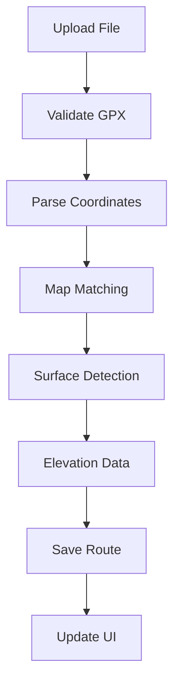

# GPX Upload and Processing System

## Overview
The GPX system handles file uploads, processing, and visualization of GPX route data with surface detection and elevation profiles.

## System Components

### 1. Upload Interface
```typescript
// packages/ui/upload/GpxUpload.tsx
interface GpxUploadProps {
  onUploadComplete: (routeId: string) => void;
  onError: (error: Error) => void;
}
```

### 2. Processing Pipeline



### 3. API Layer

```typescript
// packages/api/router/gpx.ts
export const gpxRouter = createTRPCRouter({
  upload: privateProcedure
    .input(gpxUploadSchema)
    .mutation(async ({ input, ctx }) => {
      // Handle upload
    }),
  process: privateProcedure
    .input(gpxProcessSchema)
    .mutation(async ({ input, ctx }) => {
      // Process GPX data
    })
});
```

## Implementation Details

### 1. File Upload
- Drag-and-drop interface
- Type validation (.gpx files)
- Size limits (configurable)
- Progress indication

### 2. GPX Processing
```typescript
// packages/map-core/gpx/processor.ts
interface GpxProcessor {
  parseFile(buffer: Buffer): Promise<GpxData>;
  simplifyTrack(points: Point[]): Point[];
  matchToRoads(points: Point[]): Promise<MatchedRoute>;
  detectSurfaces(route: MatchedRoute): Promise<SurfaceData>;
  processElevation(route: MatchedRoute): Promise<ElevationData>;
}
```

### 3. Database Schema
```prisma
// packages/db/prisma/schema.prisma
model Route {
  id          String   @id @default(cuid())
  name        String
  description String?
  userId      String
  createdAt   DateTime @default(now())
  updatedAt   DateTime @updatedAt
  
  points      Point[]
  surfaces    Surface[]
  elevation   Elevation[]
  statistics  RouteStats?
}
```

### 4. UI Components

#### Route Display
- Map visualization
- Elevation profile
- Surface indicators
- Statistics panel

#### Route Management
- Color customization
- Visibility toggles
- Edit capabilities
- Delete options

## Performance Considerations

1. **Large File Handling**
   - Stream processing for large files
   - Chunked uploads
   - Progressive loading

2. **Data Optimization**
   - Point simplification
   - Cached elevation data
   - Efficient database queries

3. **UI Responsiveness**
   - Async processing
   - Loading states
   - Optimistic updates

## Error Handling

1. **Upload Errors**
   - File type validation
   - Size validation
   - Corrupt file detection

2. **Processing Errors**
   - Invalid GPX format
   - API failures
   - Database errors

## Testing Strategy

1. **Unit Tests**
   - GPX parsing
   - Data processing
   - Surface detection

2. **Integration Tests**
   - Upload flow
   - Processing pipeline
   - Database operations

3. **E2E Tests**
   - Complete upload process
   - UI interactions
   - Error scenarios

## Future Improvements

1. **Advanced Features**
   - Batch uploads
   - Route combining
   - Split route capability
   - Route alternatives

2. **Performance**
   - WebAssembly processing
   - Worker thread utilization
   - Improved caching

3. **Integration**
   - Strava import
   - Garmin connect
   - Social sharing

## Related Components
- [POI System](POI.md)
- [Photo Management](PHOTOS.md)
- [Map Operations](MAPS.md)