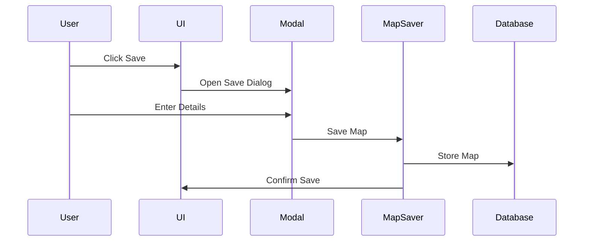
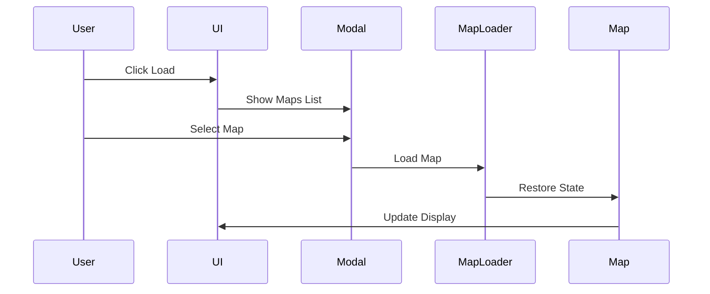
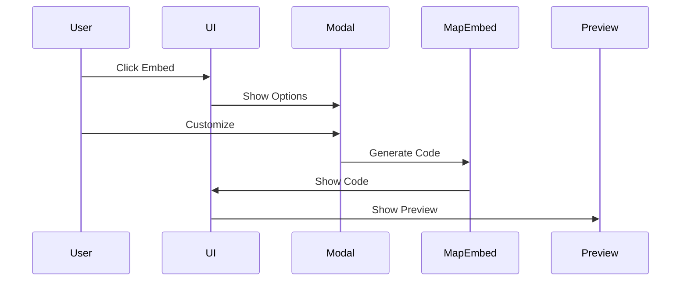

# Map Operations System

## Overview
The map operations system handles saving, loading, and embedding maps, including all associated data like GPX routes, POIs, and photos.

## Data Structures

### Map State
```typescript
// packages/types/maps.ts
interface SavedMap {
  id: string;
  name: string;
  description?: string;
  createdAt: Date;
  updatedAt: Date;
  createdBy: string;
  isPublic: boolean;
  
  // Map State
  viewState: ViewState;
  
  // Associated Data
  routes: SavedRoute[];
  pois: SavedPOI[];
  photos: SavedPhoto[];
  
  // Metadata
  stats: MapStats;
  settings: MapSettings;
}

interface ViewState {
  center: [number, number];
  zoom: number;
  pitch?: number;
  bearing?: number;
  bounds?: BoundingBox;
}
```

### Database Schema
```prisma
// packages/db/prisma/schema.prisma
model Map {
  id          String   @id @default(cuid())
  name        String
  description String?
  createdAt   DateTime @default(now())
  updatedAt   DateTime @updatedAt
  createdBy   String
  isPublic    Boolean  @default(false)
  
  // JSON fields
  viewState   Json
  settings    Json?
  stats       Json?
  
  // Relations
  routes      Route[]
  pois        POI[]
  photos      Photo[]
  
  // Indexes
  @@index([createdBy])
  @@index([isPublic])
}
```

## Core Operations

### 1. Save System
```typescript
// packages/features/maps/save.ts
interface MapSaver {
  saveMap(data: MapSaveData): Promise<SavedMap>;
  autoSave(mapId: string): Promise<void>;
  createSnapshot(mapId: string): Promise<string>;
  validateMapData(data: MapSaveData): ValidationResult;
}
```

### 2. Load System
```typescript
// packages/features/maps/load.ts
interface MapLoader {
  loadMap(mapId: string): Promise<SavedMap>;
  restoreState(map: SavedMap): Promise<void>;
  loadAssociatedData(mapId: string): Promise<AssociatedData>;
  handleLoadError(error: LoadError): void;
}
```

### 3. Embed System
```typescript
// packages/features/maps/embed.ts
interface MapEmbed {
  generateEmbed(mapId: string): Promise<EmbedCode>;
  customizeEmbed(options: EmbedOptions): EmbedCode;
  validateEmbed(code: string): boolean;
}
```

## User Interfaces

### 1. Save Modal
```typescript
// packages/ui/components/maps/SaveModal.tsx
interface SaveModalProps {
  currentMap: MapState;
  onSave: (data: MapSaveData) => Promise<void>;
  onCancel: () => void;
  isAutosaving?: boolean;
}
```

### 2. Load Modal
```typescript
// packages/ui/components/maps/LoadModal.tsx
interface LoadModalProps {
  maps: SavedMap[];
  onLoad: (mapId: string) => Promise<void>;
  onDelete: (mapId: string) => Promise<void>;
  onShare: (mapId: string) => void;
}
```

### 3. Embed Modal
```typescript
// packages/ui/components/maps/EmbedModal.tsx
interface EmbedModalProps {
  map: SavedMap;
  onCustomize: (options: EmbedOptions) => void;
  onCopy: () => void;
  onPreview: () => void;
}
```

## Implementation Workflows

### 1. Save Workflow


### 2. Load Workflow


### 3. Embed Workflow


## State Management

### 1. Map State
```typescript
// packages/features/maps/state.ts
interface MapStateManager {
  saveState(): MapState;
  loadState(state: MapState): void;
  resetState(): void;
  mergeState(partial: Partial<MapState>): void;
}
```

### 2. Versioning
```typescript
// packages/features/maps/versions.ts
interface MapVersioning {
  createVersion(mapId: string): Promise<string>;
  listVersions(mapId: string): Promise<MapVersion[]>;
  restoreVersion(versionId: string): Promise<void>;
}
```

## Security

### 1. Access Control
```typescript
// packages/features/maps/security.ts
interface MapSecurity {
  checkAccess(userId: string, mapId: string): Promise<boolean>;
  grantAccess(mapId: string, userId: string): Promise<void>;
  revokeAccess(mapId: string, userId: string): Promise<void>;
}
```

### 2. Embed Security
```typescript
// packages/features/maps/embed-security.ts
interface EmbedSecurity {
  generateToken(mapId: string): string;
  validateToken(token: string): boolean;
  restrictDomains(domains: string[]): void;
}
```

## Performance Optimization

### 1. State Optimization
```typescript
// packages/features/maps/optimization.ts
interface StateOptimization {
  compressState(state: MapState): CompressedState;
  optimizeForEmbed(state: MapState): EmbedState;
  cleanupUnused(state: MapState): MapState;
}
```

### 2. Load Optimization
```typescript
// packages/features/maps/loading.ts
interface LoadOptimization {
  preloadData(mapId: string): void;
  prioritizeVisible(bounds: BoundingBox): void;
  deferLoading(items: LoadItem[]): void;
}
```

## Error Handling

### 1. Save Errors
```typescript
// packages/features/maps/errors.ts
interface SaveErrorHandler {
  handleSaveError(error: Error): UserMessage;
  recoverAutoSave(mapId: string): Promise<void>;
  validateBeforeSave(data: MapSaveData): void;
}
```

### 2. Load Errors
```typescript
// packages/features/maps/errors.ts
interface LoadErrorHandler {
  handleLoadError(error: Error): UserMessage;
  recoverCorruptedState(state: MapState): MapState;
  handleMissingData(mapId: string): Promise<void>;
}
```

## Future Improvements

1. **Advanced Features**
   - Collaborative editing
   - Real-time sync
   - Version control
   - Map templates

2. **Performance**
   - Progressive loading
   - State compression
   - Partial updates
   - Background sync

3. **Integration**
   - Social sharing
   - Export formats
   - API access
   - Mobile sync

## Related Documentation
- [GPX.md](GPX.md) - GPX integration
- [POI.md](POI.md) - POI system
- [PHOTOS.md](PHOTOS.md) - Photo integration