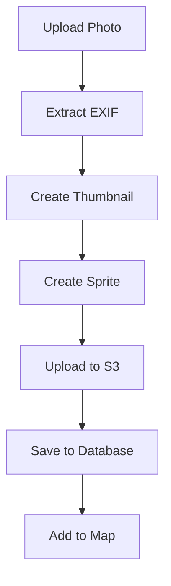

# Photo Management System

## Overview
The photo management system handles GPX-tagged photos, including upload, processing, storage, and map integration with sprite-based visualization.

## System Architecture

### Data Structure
```typescript
// packages/types/photo.ts
interface Photo {
  id: string;
  userId: string;
  filename: string;
  originalUrl: string;
  thumbnailUrl: string;
  spriteUrl: string;
  coordinates?: [number, number];
  takenAt: Date;
  metadata: PhotoMetadata;
  createdAt: Date;
  updatedAt: Date;
}

interface PhotoMetadata {
  exif?: ExifData;
  gpx?: GpxData;
  size: number;
  dimensions: {
    width: number;
    height: number;
  };
  hash: string;
}
```

### Database Schema
```prisma
// packages/db/prisma/schema.prisma
model Photo {
  id            String   @id @default(cuid())
  userId        String
  filename      String
  originalUrl   String
  thumbnailUrl  String
  spriteUrl     String
  latitude      Float?
  longitude     Float?
  takenAt       DateTime
  metadata      Json
  createdAt     DateTime @default(now())
  updatedAt     DateTime @updatedAt

  // Relations
  pois          POI[]
  routes        Route[]
  
  @@index([latitude, longitude])
}
```

## Upload Process

### 1. Upload Component
```typescript
// packages/ui/components/photos/PhotoUpload.tsx
interface PhotoUpload {
  onUpload: (files: File[]) => Promise<void>;
  onProgress: (progress: number) => void;
  onError: (error: Error) => void;
}
```

### 2. Processing Pipeline


### 3. Image Processing
```typescript
// packages/features/photos/processing.ts
interface PhotoProcessor {
  extractExif(file: File): Promise<ExifData>;
  createThumbnail(file: File): Promise<Blob>;
  createSprite(file: File): Promise<Blob>;
  optimizeForWeb(file: File): Promise<Blob>;
}
```

## Storage System

### 1. S3 Integration
```typescript
// packages/features/photos/storage.ts
interface PhotoStorage {
  uploadOriginal(file: File): Promise<string>;
  uploadThumbnail(thumbnail: Blob): Promise<string>;
  uploadSprite(sprite: Blob): Promise<string>;
  deletePhoto(photoId: string): Promise<void>;
}
```

### 2. File Organization
```typescript
// S3 Bucket Structure
photos/
├── originals/
│   └── {userId}/
│       └── {photoId}.jpg
├── thumbnails/
│   └── {userId}/
│       └── {photoId}.jpg
└── sprites/
    └── {userId}/
        └── {photoId}.png
```

## Map Integration

### 1. Sprite Management
```typescript
// packages/map-core/photos/PhotoLayer.ts
interface PhotoLayer {
  addToMap(photo: Photo): void;
  removeFromMap(photoId: string): void;
  updatePosition(photoId: string, coordinates: [number, number]): void;
  toggleVisibility(visible: boolean): void;
}
```

### 2. Clustering
```typescript
// packages/map-core/photos/PhotoClustering.ts
interface PhotoClustering {
  cluster(photos: Photo[], zoom: number): PhotoCluster[];
  updateClusters(bounds: BoundingBox): void;
  handleZoomChange(newZoom: number): void;
}
```

## UI Components

### 1. Photo Gallery
```typescript
// packages/ui/components/photos/Gallery.tsx
interface GalleryProps {
  photos: Photo[];
  onPhotoSelect: (photo: Photo) => void;
  onPhotoDelete: (photoId: string) => void;
  layout: 'grid' | 'list';
}
```

### 2. Photo Modal
```typescript
// packages/ui/components/photos/PhotoModal.tsx
interface PhotoModalProps {
  photo: Photo;
  onClose: () => void;
  onEdit: (updates: Partial<Photo>) => void;
  onDelete: (photoId: string) => void;
}
```

## Performance Optimization

### 1. Image Loading
```typescript
// packages/features/photos/loading.ts
interface PhotoLoading {
  preloadThumbnails(photos: Photo[]): void;
  lazyLoadOriginals(photos: Photo[]): void;
  unloadDistantPhotos(bounds: BoundingBox): void;
}
```

### 2. Caching Strategy
```typescript
// packages/features/photos/caching.ts
interface PhotoCache {
  cachePhoto(photo: Photo): void;
  getCachedPhoto(photoId: string): Photo | null;
  clearCache(): void;
  pruneCache(maxSize: number): void;
}
```

## Error Handling

### 1. Upload Errors
```typescript
// packages/features/photos/errors.ts
class PhotoUploadError extends Error {
  constructor(
    public stage: 'upload' | 'processing' | 'storage',
    public reason: string,
    public retryable: boolean
  ) {
    super(`Photo upload failed at ${stage}: ${reason}`);
  }
}
```

### 2. Processing Errors
```typescript
// packages/features/photos/validation.ts
interface PhotoValidation {
  validateFile(file: File): ValidationResult;
  validateExif(exif: ExifData): ValidationResult;
  handleProcessingError(error: Error): UserMessage;
}
```

## Feature Implementation

### 1. Photo Upload
```typescript
// Implementation steps
1. Configure drop zone
2. Handle file selection
3. Validate files
4. Process EXIF data
5. Create thumbnails
6. Upload to S3
7. Save to database
8. Add to map
```

### 2. Photo Display
```typescript
// Implementation steps
1. Create sprite layer
2. Implement clustering
3. Handle zoom levels
4. Setup hover effects
5. Configure click actions
6. Manage visibility
```

## Testing Strategy

### 1. Unit Tests
```typescript
// packages/features/photos/__tests__/photos.test.ts
describe('Photo Processing', () => {
  test('extracts EXIF data', async () => {});
  test('creates thumbnails', async () => {});
  test('validates files', () => {});
});
```

### 2. Integration Tests
```typescript
// packages/features/photos/__tests__/integration.test.ts
describe('Photo Integration', () => {
  test('uploads photos', async () => {});
  test('displays on map', async () => {});
  test('manages clusters', async () => {});
});
```

## Future Improvements

1. **Advanced Features**
   - Face detection
   - AI tagging
   - Photo stories
   - Time-based visualization

2. **Performance**
   - WebGL rendering
   - Advanced caching
   - Progressive loading
   - Compressed sprites

3. **Integration**
   - Social sharing
   - Third-party imports
   - Photo albums
   - Route association

## Related Documentation
- [POI.md](POI.md) - POI integration
- [MAPS.md](MAPS.md) - Map integration
- [API.md](../TECHNICAL/API.md) - API documentation