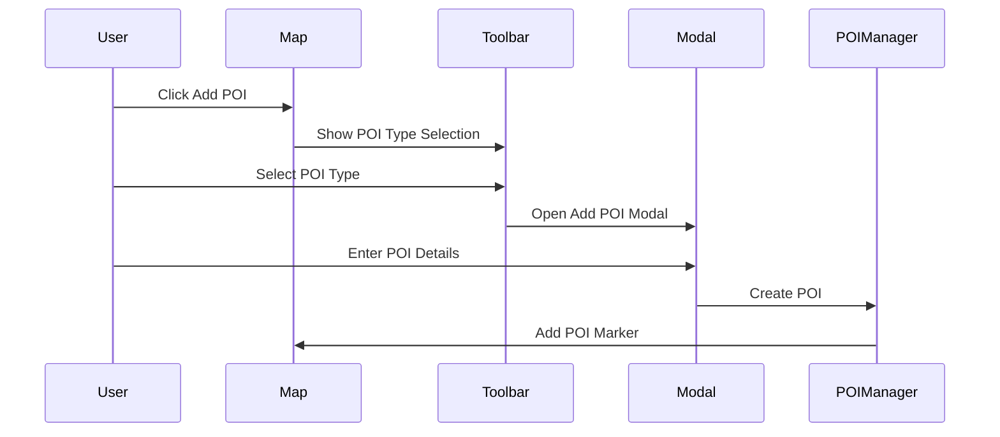
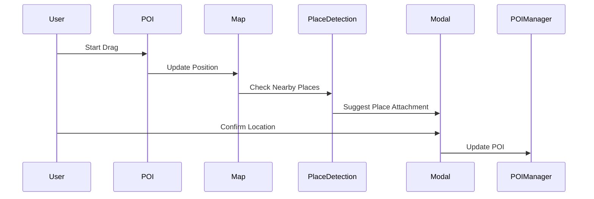

# Points of Interest (POI) System

## Overview
The POI system manages different types of points of interest across the map, including manual POIs, place POIs, infrastructure POIs, and service POIs.

## Data Structure

### POI Types
```typescript
// packages/types/poi.ts
interface BasePOI {
  id: string;
  name: string;
  description?: string;
  coordinates: [number, number];
  type: POIType;
  createdAt: Date;
  updatedAt: Date;
  userId: string;
}

enum POIType {
  MANUAL = 'manual',    // User-created, draggable
  PLACE = 'place',      // Fixed to locations
  INFRASTRUCTURE = 'infrastructure',
  SERVICE = 'service'
}

interface ManualPOI extends BasePOI {
  type: POIType.MANUAL;
  customData?: Record<string, any>;
  isDraggable: boolean;
}

interface PlacePOI extends BasePOI {
  type: POIType.PLACE;
  placeId: string;
  address?: string;
}
```

### Database Schema
```prisma
// packages/db/prisma/schema.prisma
model POI {
  id          String   @id @default(cuid())
  name        String
  description String?
  type        String
  latitude    Float
  longitude   Float
  userId      String
  createdAt   DateTime @default(now())
  updatedAt   DateTime @updatedAt
  
  // Relations
  photos      Photo[]
  categories  Category[]
  metadata    Json?
  
  // Indexes
  @@index([latitude, longitude])
}
```

## Components

### 1. POI Manager
```typescript
// packages/map-core/poi/POIManager.tsx
interface POIManager {
  addPOI(data: NewPOIData): Promise<POI>;
  updatePOI(id: string, data: POIUpdateData): Promise<POI>;
  deletePOI(id: string): Promise<void>;
  movePOI(id: string, coordinates: [number, number]): Promise<POI>;
}
```

### 2. POI Toolbar
```typescript
// packages/ui/components/poi/POIToolbar.tsx
interface POIToolbarProps {
  onAddPOI: () => void;
  onToggleVisibility: () => void;
  onFilterChange: (filters: POIFilters) => void;
}
```

### 3. POI Modal System
```typescript
// packages/ui/components/poi/POIModal.tsx
type POIModalType = 'add' | 'edit' | 'view' | 'delete';

interface POIModalProps {
  type: POIModalType;
  poi?: POI;
  onSave: (data: POIData) => Promise<void>;
  onClose: () => void;
}
```

## Features Implementation

### 1. POI Creation
```typescript
// packages/features/poi/creation.ts
interface POICreation {
  validatePOIData(data: NewPOIData): ValidationResult;
  createPOI(data: ValidatedPOIData): Promise<POI>;
  attachToMap(poi: POI): void;
}
```

### 2. POI Interaction
```typescript
// packages/features/poi/interaction.ts
interface POIInteraction {
  enableDragging(poiId: string): void;
  handleClick(poiId: string): void;
  handleHover(poiId: string): void;
}
```

### 3. Place Detection
```typescript
// packages/features/poi/places.ts
interface PlaceDetection {
  detectNearbyPlaces(coordinates: [number, number]): Promise<Place[]>;
  attachPOIToPlace(poiId: string, placeId: string): Promise<void>;
  detachPOIFromPlace(poiId: string): Promise<void>;
}
```

## UI Workflows

### 1. Adding a POI


### 2. Moving a POI


## Performance Optimization

### 1. Spatial Indexing
```sql
CREATE INDEX poi_location_idx ON pois USING GIST (
  ST_SetSRID(ST_MakePoint(longitude, latitude), 4326)
);
```

### 2. Clustering Strategy
```typescript
// packages/map-core/poi/clustering.ts
interface POIClustering {
  clusterPOIs(pois: POI[], zoom: number): ClusteredPOI[];
  updateClusters(bounds: BoundingBox): void;
}
```

### 3. Loading Strategy
```typescript
// packages/map-core/poi/loading.ts
interface POILoading {
  loadPOIsInView(bounds: BoundingBox): Promise<POI[]>;
  prefetchNearbyPOIs(center: [number, number]): void;
}
```

## Error Handling

### 1. Validation Errors
```typescript
// packages/features/poi/validation.ts
interface POIValidation {
  validateCoordinates(coords: [number, number]): boolean;
  validateMetadata(metadata: any): ValidationResult;
  handleValidationError(error: ValidationError): UserMessage;
}
```

### 2. Operation Errors
```typescript
// packages/features/poi/errors.ts
class POIOperationError extends Error {
  constructor(
    public operation: 'create' | 'update' | 'delete',
    public reason: string,
    public recoverable: boolean
  ) {
    super(`POI ${operation} failed: ${reason}`);
  }
}
```

## Testing Strategy

### 1. Unit Tests
```typescript
// packages/features/poi/__tests__/poi.test.ts
describe('POI Management', () => {
  test('creates valid POI', async () => {});
  test('validates POI data', () => {});
  test('handles invalid coordinates', () => {});
});
```

### 2. Integration Tests
```typescript
// packages/features/poi/__tests__/integration.test.ts
describe('POI Integration', () => {
  test('adds POI to map', async () => {});
  test('syncs with database', async () => {});
  test('handles place attachment', async () => {});
});
```

## Future Improvements

1. **Advanced Features**
   - POI routing
   - Time-based POIs
   - POI sharing
   - Rich media attachments

2. **Performance**
   - WebGL markers
   - Virtual rendering
   - Advanced clustering

3. **Integration**
   - Third-party POI import
   - API for external access
   - Mobile optimization

## Related Documentation
- [PHOTOS.md](PHOTOS.md) - Photo integration with POIs
- [MAPS.md](MAPS.md) - Map integration
- [API.md](../TECHNICAL/API.md) - API documentation